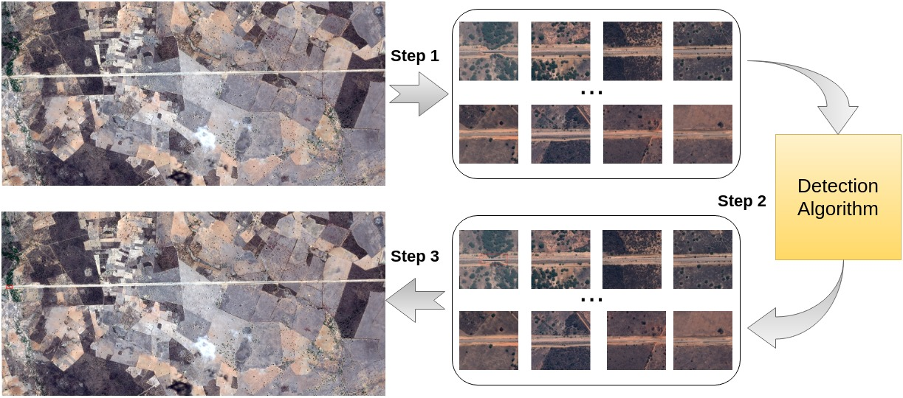
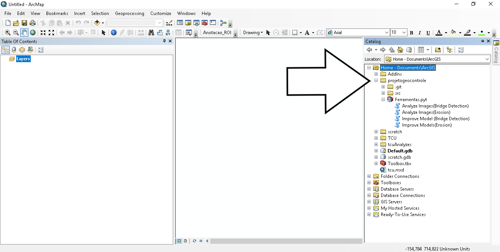
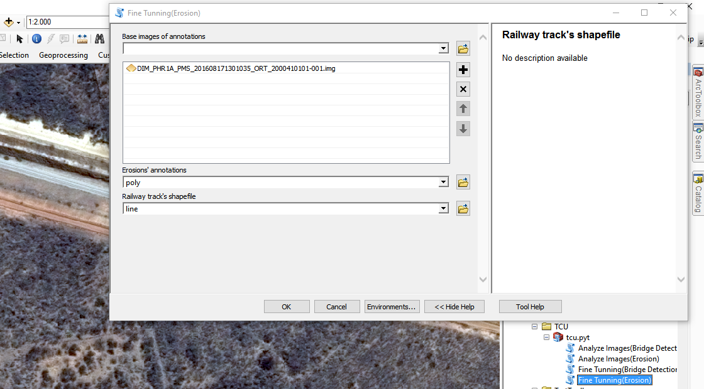
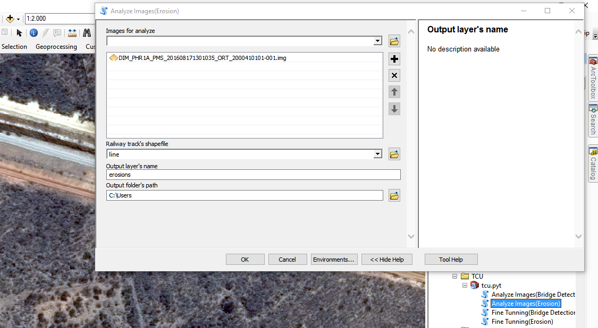

# [ArcGIS Plugin] Deep Learning Framework for Large Scale Images

# The framework's pipeline

This framework was proposed to train and infer CNNs for the tasks of semantic segmentation and object detection using large scale images and annotations made using shapefiles. The figure bellow illustrates how the framework for object detection works, understanding how it wotks, it's analogue to figure out how it can be usedfor semantic segmantation.



Looking at the figure, in the first phase, the input image mosaic are split into overlapping patches, that are generated taking into account the geospatial data (that has the coordinates of the target, in the case of the figure a railway), i.e., the pathway is always in the center of these patches. In the second step of the proposed tool, those patches are processed by a deep
learning-based approach, that detects the target object (in the case of the figure, bridges). Finally, in the third
step, the bounding-boxes of detected bridges in the patches are merged into a single final result.

All steps of the framework are implemented to work in ArcGIS via a plugin, and there is also a web service implementation of it in this repository. 

# Datasets

Both datasets are publicly available for download. To dowload the railway bridge detection dataset, please use the following link:

http://www.patreo.dcc.ufmg.br/2019/07/10/bridge-dataset/

To download the railway erosion dataset, please use the following link:

https://drive.google.com/file/d/1LE9tFt3VMka9hQtGnd7QkAQhZsU_COEa/view?usp=sharing

# Plugin instalation

The plugin installation is quite easy. The only step needed is to copy this repository to the folder that ArcGis is installed. Typically it can be found in C:\Users\Usename\Documents\ArcGIS DocumentosnArcGIS).
After that, open ArcGIS software and you'll be able to visualize the plugin on the right bar, as can be seen in the figure below.


# Web Service

There is a web service implementation of the framework located in scr/webservice. To use the server, run the following command:
```diff
python3 server.py <port_number>
```

# Using your own network in the framework

To use your network and integrate it into the framework, you will need to edit some files.
First, for image segmentation, you will need to edit the file segmentationTools.py. The only alteration you need to perform is to change the cmd variable to handle the command used to run your network. For object detection, the only difference is that you have to edit a different file, called detectionTools.py.


The same process can be done for the web service editing the file /src/webservice/server.py with your network commands.
In this implementation, there isn`t an example code for object detection, but for image segmentation there is one, using Mask-R-CNN. 


# Plugin Use

The use of the plugin is quite simple since it has an intuitive interface. The only thing you have to do is to select the desired option and fill all the options with the desired data. The figures bellow illustrates the plugin interface.




In case of any doubts, please e-mail us:

       Keiller Nogueira - keiller.nogueira@dcc.ufmg.br

       Caio Cesar - caiosilva@dcc.ufmg.br

       Gabriel L. S. Machado - gabriel.lucas@dcc.ufmg.br

       Pedro H. T. Gama - phtg@dcc.ufmg.br

       Jefersson A. dos Santos - jefersson@dcc.ufmg.br


If you have interest in other works of our laboratory, please visit our website:

http://www.patreo.dcc.ufmg.br/

Please cite us

       @inproceedings{nogueira2019tool,

             title={A Tool for Bridge Detection in Major Infrastructure Works Using Satellite Images},
  
             author={Nogueira, Keiller and Cesar, Caio and Gama, Pedro HT and Machado, Gabriel LS and dos Santos, Jefersson A},
  
             booktitle={2019 XV Workshop de Vis{\~a}o Computacional (WVC)},
  
             pages={72--77},
  
             year={2019},
  
             organization={IEEE}

       }
